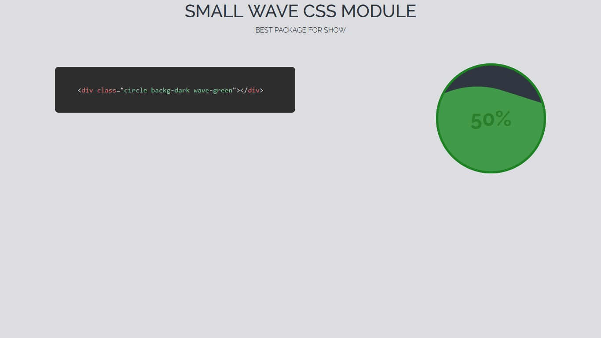

# Small Wave - Css Module

## Table of Contents

- [About](#about)
- [Getting Started](#getting_started)
- [Usage](#usage)
- [Demo](#demo)

## About <a name = "about"></a>

This small project can make your websites more attractive.

## Demo <a name = "demo"></a>
Click on the link below to see the preview.
<a href="https://codepen.io/Special_One/pen/NWvBoOV">Demo</a>
<br><br>

## Getting Started <a name = "getting_started"></a>

To use the project, just link the CSS file to your project.

### Prerequisites

Currently this package can be used without any special dependencies (this item will be updated).

### Installing

Follow the steps below to launch the project.

1 : Download Project <a href="github.com/attackeralireza/small-wave">Download</a>
or
```
git clone https://github.com/attackeralireza/small-wave.git
```

2 : Add files to project

```
 <link rel="stylesheet" href="path/plugins/prism/css/prism.css" />
```

End with an example of getting some data out of the system or using it for a little demo.

## Usage <a name = "usage"></a>

### Basic Uasage In HTML
```
<div class="circle"></div>
```
### Background Color Classes

`Backg-xxx`

- dark
- light
- blue
- red
- green
- red

#### Example

```
<div class="circle backg-dark">
```
### Wave Color Classes
``
`wave-xxx`

- dark
- light
- blue
- red
- green
- red

#### Example

```
<div class="circle backg-dark wave-red">
```

### Use Progress Text

1 : Add `.progress` Class
<br>
Exmaple:

```
<div class="circle backg-dark wave-blue">
  <div class="progress">
    <span>50%</span>
  </div>
</div>
```


